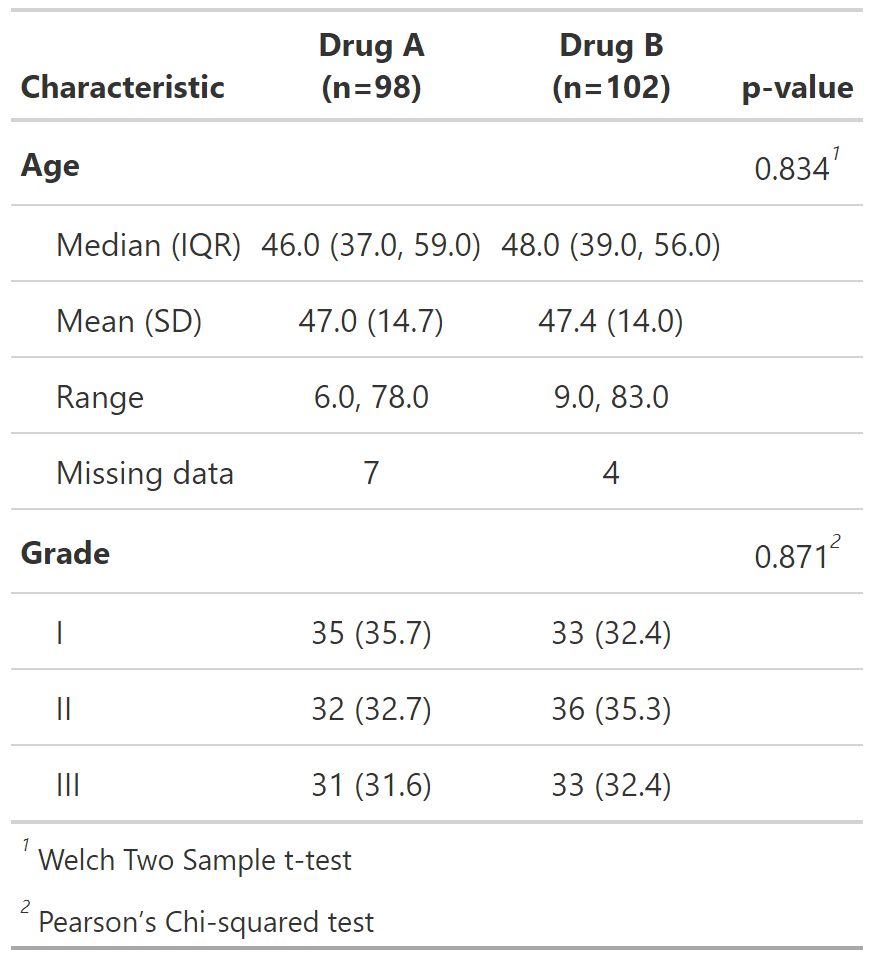

<!-- README.md is generated from README.Rmd. Please edit that file -->

```{r, include = FALSE}
knitr::opts_chunk$set(echo = TRUE)
```

# psbmisc

This package provides a collection of miscellaneous functions for personal use. Currently, it includes custom themes for `gtsummary` tables in both English and Spanish.

## Installation

You can install the development version of `psbmisc` from GitHub with:

```r 
install.packages("devtools")
devtools::install_github("psotob91/psbmisc")
```

## Usage

Load the `gtsummary` and `psbmisc` packages:

```{r, message=FALSE} 
library(gtsummary)
library(psbmisc)
```

```{r, message=FALSE, echo=FALSE} 
library(gt)
library(webshot2)
```

We can set the prefered `theme`:

```{r} 
# Set English theme for gtsummary tables
set_gtsummary_theme(my_theme_en)
```

And then create the table:

```r
# Create a tbl_summary
trial %>%
  select(age, grade, trt) %>%
  tbl_summary(by = trt) %>% 
  add_p(age ~ "t.test") %>% 
  separate_p_footnotes() %>% 
  modify_footnote(everything() ~ NA)
```

```{r, echo=FALSE} 
# Create a tbl_summary
trial %>%
  select(age, grade, trt) %>%
  tbl_summary(by = trt) %>% 
  add_p(age ~ "t.test") %>% 
  separate_p_footnotes() %>% 
  modify_footnote(everything() ~ NA) %>% 
  as_gt() %>% 
  gt::gtsave("img/table.png")
```



## Contributors

| Name               | Email                 |
|--------------------|-----------------------|
| Percy Soto-Becerra | percys1991@gmail.com  |

## License

MIT + file LICENSE
